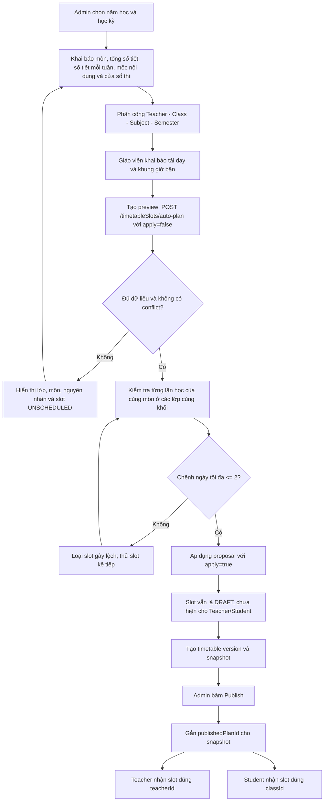
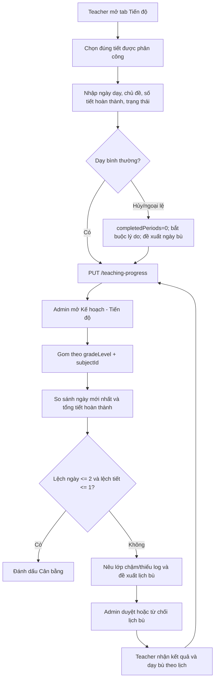
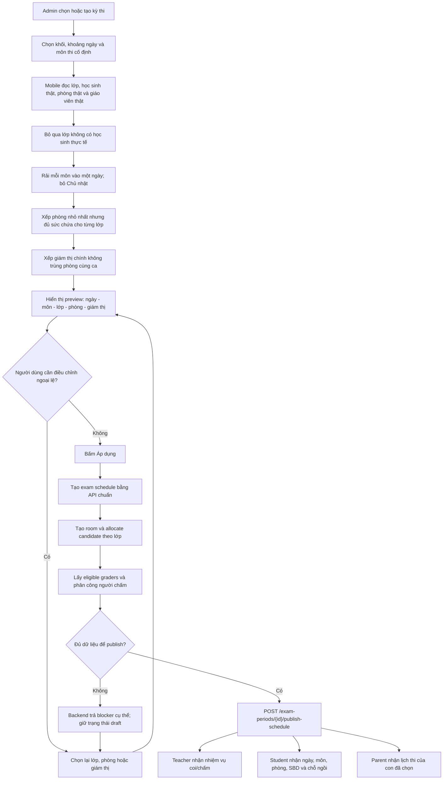

# Academic Scheduling Cross-Role Acceptance Guide

## 1. Mục tiêu và phạm vi

Tài liệu này dùng để kiểm thử các luồng liên kết giữa Admin, Giáo viên, Học sinh và Phụ huynh trong các chức năng:

- F04: kế hoạch đào tạo cố định theo năm học/học kỳ.
- F05: tự xếp thời khóa biểu và cân bằng tiến độ lớp cùng khối.
- F06–F07: ghi nhận tiến độ dạy thật, ngoại lệ và lịch bù.
- F08: tự xếp lịch thi, phòng, giám thị, thí sinh và người chấm.
- Công bố dữ liệu từ Admin sang các vai trò liên quan.

Quy tắc quan trọng: dữ liệu nháp chỉ thuộc workspace của Admin. Giáo viên, Học sinh và Phụ huynh chỉ nhận dữ liệu sau khi công bố thành công.

## 2. Tài khoản kiểm thử local

| Vai trò | Tên đăng nhập | Mật khẩu |
|---|---|---|
| Admin | `admin` | `Admin123@@` |
| Giáo viên Toán | `gv.nguyenminh` | `nguyenminh123@` |
| Giáo viên Vật lý | `gv.minh` | `teacher@123` |
| Học sinh 10A1 | `hs.nguyenminhan` | `nguyenminhanh123@@` |
| Phụ huynh | `ph.nguyenvanhung` | `nguyenvanhung123@` |

Mobile đang chạy tại `http://127.0.0.1:8080`, backend tại `http://127.0.0.1:4000`.

## 3. Use case đã chốt

| ID | Use case | Actor chính | Kết quả bắt buộc |
|---|---|---|---|
| UC-AS01 | Tạo kế hoạch đào tạo | Admin | Môn, số tiết, mốc nội dung và cửa sổ thi được khóa theo học kỳ |
| UC-AS02 | Tự xếp TKB | Admin/System | Không trùng lớp, giáo viên, phòng; cùng môn–khối lệch không quá 2 ngày |
| UC-AS03 | Công bố TKB | Admin | Tạo version, snapshot và publish thành công |
| UC-AS04 | Nhận TKB theo vai trò | Giáo viên/Học sinh | Chỉ thấy slot đã publish và đúng phạm vi được giao |
| UC-AS05 | Cập nhật tiến độ thật | Giáo viên | Chỉ cập nhật tiết được phân công; có chủ đề và số tiết hoàn thành |
| UC-AS06 | Cân bằng tiến độ/lịch bù | Admin/Giáo viên | So sánh cùng khối–môn; cảnh báo lệch ngày hoặc số tiết và xử lý lịch bù |
| UC-AS07 | Tự xếp lịch thi | Admin/System | Tự xếp ngày, phòng, giám thị, thí sinh và người chấm bằng API thật |
| UC-AS08 | Công bố lịch thi | Admin | Chỉ publish khi đủ lớp, phòng, giám thị, thí sinh và người chấm |
| UC-AS09 | Nhận lịch thi theo vai trò | Giáo viên/Học sinh/Phụ huynh | Nhận đúng nhiệm vụ coi/chấm hoặc lịch thi của học sinh sau publish |

## 4. Flowchart F04–F05: kế hoạch, tự xếp và công bố TKB

### Thuật toán cân bằng TKB

Với lần học thứ `n` của cùng `subjectId + semesterId`:

1. Gom các lớp có cùng `gradeLevel`.
2. Lấy ngày đã xếp của lần học thứ `n` ở các lớp ngang hàng.
3. Chỉ giữ slot có khoảng cách ngày tối đa là 2.
4. Xếp hạng slot theo: độ lệch ngày nhỏ nhất → tải trong ngày của lớp thấp nhất → tải môn trong ngày thấp nhất → thứ tự ngày/tiết ổn định.
5. Vẫn kiểm tra trùng lớp, giáo viên, phòng và giờ bận.
6. Nếu không còn slot hợp lệ, trả `UNSCHEDULED`; không tự phá ngưỡng cân bằng.

## 5. Flowchart F06–F07: tiến độ thật và lịch bù

Không so sánh tiến độ giữa hai khối khác nhau. Lớp chưa có log không được coi là đã cân bằng.

## 6. Flowchart F08: tự xếp và công bố lịch thi

### Các bước người dùng phải làm thủ công

1. Tạo/chọn kỳ thi, chọn khối và khoảng ngày.
2. Kiểm tra danh sách môn thi cố định.
3. Bấm **Tạo preview**.
4. Chỉ chỉnh ngày/phòng/giám thị khi có ngoại lệ thực tế.
5. Bấm **Áp dụng**, kiểm tra danh sách đã lưu rồi bấm **Công bố**.

Các bước rải ngày, chọn phòng, chọn giám thị chính, xếp thí sinh và phân công người chấm là tự động. Không nhập tay ID và không dùng mock API.

## 7. API contract duy nhất

| Chức năng | Endpoint chuẩn | Không được tạo thêm |
|---|---|---|
| Preview/apply TKB | `POST /timetableSlots/auto-plan` | `/mobile/auto-timetable`, `/web/auto-timetable` |
| Version TKB | `GET/POST /timetable-versions` | `/publish-timetable-mobile` |
| Publish TKB | `POST /timetable-versions/{id}/publish` | API publish riêng theo FE |
| TKB của vai trò | `GET /me/timetable` | API teacher/student riêng |
| Tiến độ thật | `GET/PUT /teaching-progress` | API progress riêng cho mobile |
| Duyệt lịch bù | `PUT /teaching-progress/{id}/makeup` | API approve/reject tách đôi |
| Kỳ và ca thi | `/exam-periods`, `/exam-periods/{id}/schedules` | `/auto-exam` |
| Phòng và thí sinh | `/exam-schedules/{id}/rooms`, `/exam-rooms/{id}/allocate` | API room/candidate theo FE |
| Người chấm | `/exam-schedules/{id}/eligible-graders`, `PUT /exam-schedules/{id}/graders` | API grader mobile riêng |
| Publish lịch thi | `POST /exam-periods/{id}/publish-schedule` | API publish theo role |
| Lịch thi theo vai trò | `GET /me/exam-agenda` | API student/parent/teacher tách riêng |

## 8. Test case TKB

### TC-TKB-01 — Draft không rò sang Teacher/Student

1. Đăng nhập Admin, mở **Đào tạo → Xếp TKB**.
2. Tạo preview và áp dụng nhưng chưa tạo/publish version.
3. Đăng xuất, đăng nhập Giáo viên hoặc Học sinh.
4. Mở tab **Lịch dạy/Lịch học**.

Kỳ vọng: slot mới chưa xuất hiện; `/me/timetable` không trả slot có `publishedPlanId` rỗng.

### TC-TKB-02 — Publish đến đúng giáo viên

1. Đăng nhập Admin, tạo version từ workspace hiện tại và publish.
2. Đăng nhập giáo viên được phân công.
3. Mở **Lịch dạy**, kiểm tra ngày, tiết, môn, lớp và phòng.
4. Đăng nhập giáo viên không được phân công cùng slot.

Kỳ vọng: giáo viên thứ nhất thấy slot; giáo viên thứ hai không thấy slot đó.

### TC-TKB-03 — Publish đến đúng lớp học sinh

1. Sau TC-TKB-02, đăng nhập học sinh thuộc lớp đã xếp.
2. Mở **Lịch học** và đối chiếu slot.
3. Đăng nhập học sinh lớp khác.

Kỳ vọng: chỉ học sinh thuộc `classId` của slot thấy lịch.

### TC-TKB-04 — Cân bằng cùng khối trong 2 ngày

1. Chuẩn bị ít nhất hai lớp cùng khối, cùng môn, cùng học kỳ và có phân công hợp lệ.
2. Bấm **Tạo preview**.
3. Với từng lần học thứ `n`, so sánh ngày ở các lớp.

Kỳ vọng: chênh lệch không quá 2 ngày. Nếu dữ liệu bận khiến điều này bất khả thi, lớp/môn phải ở trạng thái `UNSCHEDULED` kèm lý do; không được sinh lịch lệch âm thầm.

### TC-TKB-05 — Không trùng tài nguyên

Trong toàn bộ proposal, kiểm tra mỗi ca:

- Một lớp không học hai môn cùng giờ.
- Một giáo viên không dạy hai lớp cùng giờ.
- Một phòng không chứa hai lớp cùng giờ.
- Không dùng slot giáo viên đã khai báo bận.

## 9. Test case tiến độ

### TC-PROG-01 — Giáo viên cập nhật đúng scope

1. Đăng nhập giáo viên, mở tab **Tiến độ**.
2. Chọn tiết được giao, nhập chủ đề và số tiết hoàn thành, lưu.
3. Thử gửi `timetableSlotId` của giáo viên khác.

Kỳ vọng: bước 2 thành công; bước 3 trả 403.

### TC-PROG-02 — Phát hiện lớp chậm

1. Tạo log cùng môn cho hai lớp cùng khối với ngày lệch trên 2 ngày hoặc số tiết lệch trên 1.
2. Đăng nhập Admin, mở **Đào tạo → Kế hoạch → Tiến độ**.

Kỳ vọng: nhóm bị đánh dấu chưa cân bằng, nêu đúng lớp chậm và gợi ý lịch bù.

### TC-PROG-03 — Ngoại lệ và duyệt lịch bù

1. Giáo viên ghi trạng thái `CANCELLED`, lý do và ngày bù sau ngày hủy.
2. Admin duyệt lịch bù.
3. Giáo viên kiểm tra trạng thái duyệt và cập nhật sau khi dạy bù.

Kỳ vọng: log hủy có `completedPeriods=0`; log đã được review không bị sửa âm thầm.

## 10. Test case lịch thi

### TC-EXAM-01 — Preview tự động từ dữ liệu thật

1. Đăng nhập Admin, mở **Đào tạo → Kỳ thi**.
2. Tạo kỳ thi với grade `10` hoặc `K10`, khoảng ngày đủ dài.
3. Chọn môn có giáo viên đúng chuyên môn, bấm **Tạo preview**.

Kỳ vọng: mỗi card hiển thị ngày, môn, lớp, phòng, giám thị và số học sinh thật. `10` và `K10` phải nhận cùng lớp.

### TC-EXAM-02 — Không đủ tài nguyên

Chuẩn bị số lớp thi đồng thời lớn hơn số phòng đủ sức chứa hoặc số giáo viên khả dụng, rồi tạo preview.

Kỳ vọng: dừng trước khi ghi dữ liệu và thông báo thiếu phòng/giáo viên; không sinh ca thi rác.

### TC-EXAM-03 — Áp dụng đầy đủ

1. Từ preview hợp lệ, bấm **Áp dụng**.
2. Mở danh sách lịch đã lưu.
3. Kiểm tra API room, candidate và grader của từng schedule.

Kỳ vọng: mỗi lớp có một phòng đủ chỗ, giám thị chính, danh sách thí sinh và giáo viên chấm đúng chuyên môn.

### TC-EXAM-04 — Backend chặn publish thiếu dữ liệu

Xóa hoặc bỏ một trong các thành phần: phòng, giám thị chính, thí sinh hoặc người chấm; sau đó bấm **Công bố**.

Kỳ vọng: publish thất bại, thông báo nêu đúng môn/lớp còn thiếu và kỳ thi vẫn chưa công bố.

### TC-EXAM-05 — Lịch thi liên kết các vai trò

1. Hoàn tất và công bố kỳ thi.
2. Đăng nhập giáo viên được gán giám thị: kiểm tra nhiệm vụ `PROCTOR`.
3. Đăng nhập giáo viên được gán chấm: kiểm tra ca/lớp cần chấm.
4. Đăng nhập học sinh: kiểm tra môn, ngày, giờ, phòng, SBD và chỗ ngồi.
5. Đăng nhập phụ huynh, chọn đúng con: kiểm tra cùng lịch thi.

Kỳ vọng: mọi vai trò đọc cùng một schedule đã publish; không có lịch được dựng riêng trên mobile.

## 11. Kết quả kiểm tra hiện tại

| Hạng mục | Kết quả |
|---|---|
| `flutter analyze` | Đạt, không có issue |
| Integration test TKB version/publish | Đạt |
| Integration test kỳ thi, phân công chấm và agenda đa vai trò | Đạt |
| Live API giáo viên `/me/timetable` | 5 slot, tất cả có `publishedPlanId` |
| Live API học sinh 10A1 `/me/timetable` | 6 slot, tất cả thuộc `c-10a1` và đã publish |
| Mobile Giáo viên | Hiển thị lịch dạy thật |
| Mobile Học sinh | Hiển thị lịch học thật |
| Mobile Admin F08 | Hiển thị quy trình 5 bước và dữ liệu backend thật |

## 12. Tiêu chí nghiệm thu

- [ ] Draft TKB không xuất hiện với Teacher/Student.
- [ ] Publish TKB đến đúng teacher và class.
- [ ] Cùng môn ở các lớp cùng khối lệch không quá 2 ngày.
- [ ] Không trùng lớp, giáo viên, phòng hoặc giờ bận.
- [ ] Tiến độ chỉ so sánh trong cùng khối và cùng môn.
- [ ] Lớp chậm/thiếu log có cảnh báo và đề xuất bù cụ thể.
- [ ] Preview thi dùng học sinh, phòng và giáo viên thật.
- [ ] Apply tự tạo đủ room, candidate và grader.
- [ ] Publish thiếu thành phần bị backend chặn.
- [ ] Teacher, Student và Parent nhận cùng dữ liệu đã publish.
- [ ] Web và Mobile dùng chung endpoint chuẩn, không có API trùng chức năng.
